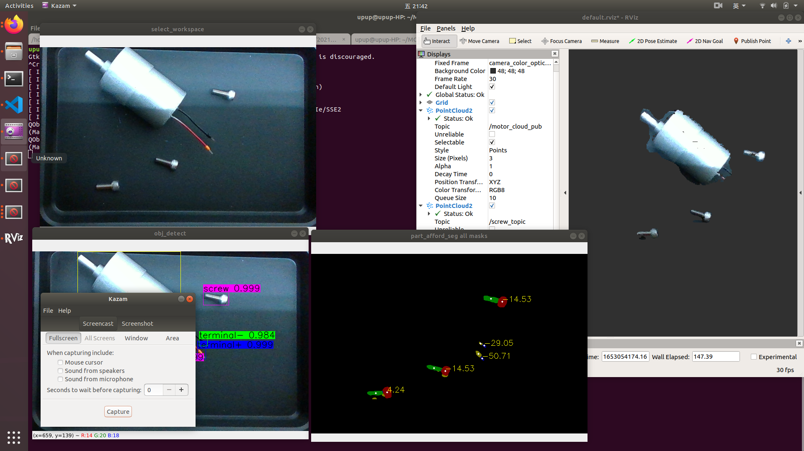
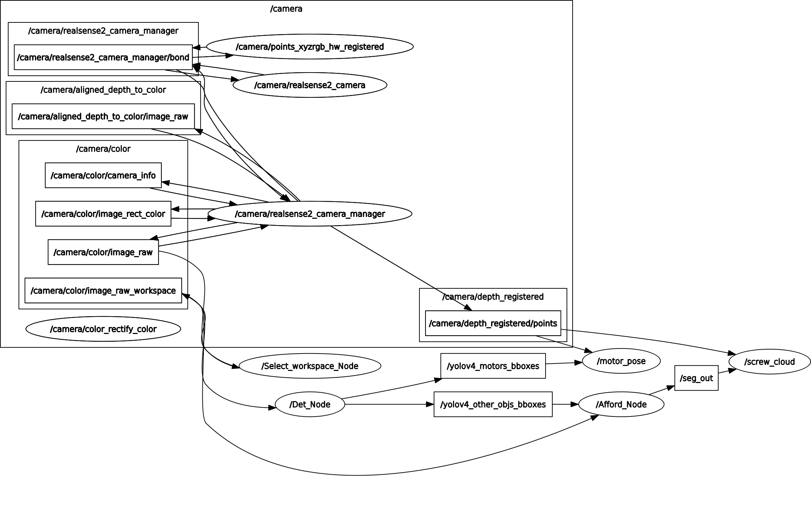

# MOST2021 Assembly

## Dependencies
* Install [realsense-ros](https://github.com/IntelRealSense/realsense-ros)
* Install [cv_bridge for Python3]()

## Software environment
* Ubuntu 18.04, 20.04
* ROS Melodic, Noetic
* Python 3.6.9 (?)
* opencv 4.5.1 cv2 (?)
* cv_bridge (python3 待測試) (?)
* Install pcl (?)
* Install cv_bridge(?)

## Function Blocks
### 1. 物件偵測 (Object Detection) obj_detect
### 2. 部件分割 (Part Segmentation) part_afford_seg
### 3. 馬達姿態估測 (Motor Pose Estimation) motor_pose_est
### 4. 夾取姿態估測 (Grasp Pose Estimation) grasp_pose_est

  

rqt_graph 
  

```
mkdir MOST2021_assembly
cd MOST2021_assembly
git clone https://github.com/uptopia/MOST2021_assembly.git src
catkin_make

<terminal 1>
cd ~/realsense_ros
. devel/setup.bash
roslaunch realsense2_camera rs_rgbd.launch

<terminal 2>
cd ~/MOST2021_assembly
. devel/setup.bash
rosrun select_workspace select_workspace.py

<terminal 3>
cd ~/MOST2021_assembly
. devel/setup.bash
rosrun obj_detect Det_Node.py

<terminal 4>
cd ~/MOST2021_assembly
. devel/setup.bash
rosrun part_afford_seg Afford_Node.py

<terminal 5>
cd ~/MOST2021_assembly
. devel/setup.bash
rosrun motor_pose motor_pose

<terminal 6>
cd ~/MOST2021_assembly
. devel/setup.bash
rosrun get_screw_cloud get_screw_cloud
```


TODO:
[ ] x_shift, y_shift publish topic
